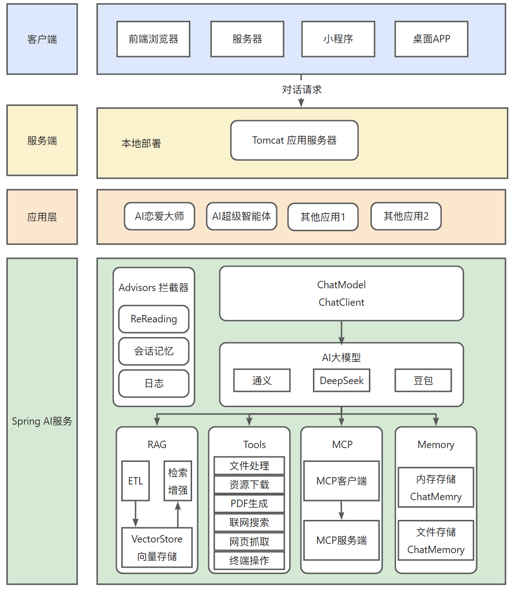

# 项目结构，项目配置和项目介绍

## 项目架构设计图

## 项目配置

### jdk用的是jdk21

### resources

1. 在resources中，有两个配置文件，一个是application.yml，一个是application-local.yml，在application-local.yml中的配置是不想让别人看到的配置，因此在.gitignore忽略了application-local.yml
2. 在application-local.yml中配置了灵积（dashscope）大模型的api-key，以及具体选用的大模型是哪个
3. 在application.yml中配置了profiles active：local，以确保application-local.yml中的配置能覆盖application.yml中的配置
4. 在application.yml中配置了server port：8123，以确保tomcat服务器启动时用8123端口，防止冲突
5. 在application.yml配置了server servlet context-path：/api，以确保访问后端接口时，前缀必须以“/api”开头
6. springdoc和knife4j下的配置，是接口文档配置，knife4j是简单易用的接口文档

